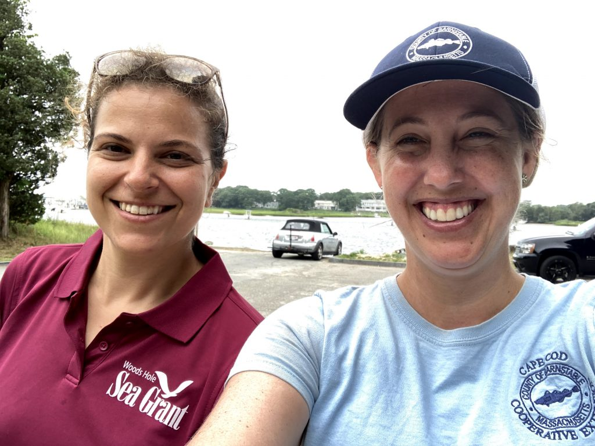

```{r setup, include=FALSE}
knitr::opts_chunk$set(echo = TRUE)
library(blastula)
devtools::source_gist(
  "c83e078bf8c81b035e32c3fc0cf04ee8", 
  filename = 'render_toc.R'
  )
```

<center> 
<font size="24"> **SNEC Newsletter** </font>

<font size="5"> *December 2021* </font>


</center>

<font size="5"> **SNEC President's Message** </font>

```{r toc, echo=FALSE} 
render_toc("2021_12.Rmd")
```

## SNEC Committee Reports 

## Student Subunit Reports 

### UConn 
### UMass Amherst

## Announcements 

### SNEC supports a new generation of biologists

Give yourself a big pat on the back! Thanks to the contributions of our members, SNEC was able to make a donation to the [Hutton Junior Fisheries Biology Program](https://hutton.fisheries.org/) which provides paid summer internships and mentoring to high school students interested in fisheries.

-----

### SNEC Winter Meeting Updates

For our Winter 2022 Science meeting, we are going to incorporate COVID precautions and offer multiple attendance options. Instead of having a large, one day event, we will offer three, mini-symposia (2-3 hours) throughout the region at:

1. UMass Amherst, 1/21/22 at 2pm at [Holdsworth Hall](https://goo.gl/maps/RpgZPykL7NCfSY5Y6)
2. UCONN Storrs, 1/22/22 at 10am at the [Biology/Physics Building](https://goo.gl/maps/duesG1fy8vTidFAc9)
3. UMass Dartmouth SMAST in New Bedford, 1/26/22 at 2pm at the [East Building](https://goo.gl/maps/K4BSD8eyj7BQNiqHA)

Masks will be required for in-person attendance, and the talks will be live streamed to provide the option for virtual attendance. We also hope to record the sessions so they can be viewed at a later time. Registration is now open [here](https://gcc02.safelinks.protection.outlook.com/?url=https%3A%2F%2Fsnec.fisheries.org%2Fmeetings%2Fmeeting-registration%2F&data=04%7C01%7Caarcher%40barnstablecounty.org%7C74af813134b742567cd808d9b3483abd%7C84475217b42348dbb766ed4bbbea74f1%7C0%7C0%7C637737945085250347%7CUnknown%7CTWFpbGZsb3d8eyJWIjoiMC4wLjAwMDAiLCJQIjoiV2luMzIiLCJBTiI6Ik1haWwiLCJXVCI6Mn0%3D%7C3000&sdata=xEbCT5%2BeINNtPeIQPMr67%2BDhEgC7c6uFWphsjJQvjGM%3D&reserved=0) - please be sure to select the correct event for in-person registration! Registration will be closed the day prior to the events, so don't wait!

Please submit abstracts [here](https://gcc02.safelinks.protection.outlook.com/?url=https%3A%2F%2Fdocs.google.com%2Fforms%2Fd%2Fe%2F1FAIpQLSduSteKq263XYzPt5_9EQpRRr4g1zJ3R7icYGrvqW2vRfYa9g%2Fviewform&data=04%7C01%7Caarcher%40barnstablecounty.org%7C74af813134b742567cd808d9b3483abd%7C84475217b42348dbb766ed4bbbea74f1%7C0%7C0%7C637737945085260293%7CUnknown%7CTWFpbGZsb3d8eyJWIjoiMC4wLjAwMDAiLCJQIjoiV2luMzIiLCJBTiI6Ik1haWwiLCJXVCI6Mn0%3D%7C3000&sdata=hRFwpr4gerAYnVbcYa6%2Foz4CR5t4D8KRNTJJRAsaVpg%3D&reserved=0), we need your content to make these sessions successful!! Abstract submission will close Friday, January 7 (Note that priority will be given to submissions from students and professionals based in the geographic region of the meeting.) Questions regarding abstract submission can be sent to sara.turner@noaa.gov.

-----

## Member Submitted Content

### Photo Essay: Aquaculture and Acidification Project
*Submitted by: Abigail Archer, Fisheries & Aquaculture Specialist with Woods Hole Sea Grant and Barnstable Cape Cod Cooperative Extension*



Follow along in [this photo essay](https://seagrant.whoi.edu/photo-essay-aquaculture-and-acidification-project) as Woods Hole Sea Grant and Cape Cod Cooperative Extension respond to a question asked by members of the Massachusetts shellfish aquaculture industry. Lab studies show that shellfish exposed to acidic conditions will have poor growth and survival. Is this happening now in the waters of Cape Cod? Will oysters and quahogs exposed to varying acidic conditions in their natural environment also have differences in growth or survival? Or will other conditions in the environment like the amount of food available, balance out the effects of acidic water?

-----

### Identifying Common Approaches and Needs for Fisheries Dependent Data
*Submitted by: Gavin Fay, Associate Professor, University of Massachusetts Dartmouth School for Marine Science and Technology*

[Click here for more information](https://www.openscapes.org/blog/2021/11/12/fdd-champions/) about the Openscapes champions workshops for Northeast fishery dependent data and open data science, organized by Gavin Fay (UMassD), Andy Jones (NOAA NEFSC), and Julie Lowndes + Anna Holder (NCEAS). This 2 month program brought together students, faculty, NOAA scientists, and other researchers through the region to discuss collaborative work practices, group work culture, and all things open data science. This workshop series was a great partnership between academic and NMFS in the region to improve workforce capacity.

-----

### The Future of Climate Change Impacts on Coastal Biodiversity
*Submitted by: Michelle Staudinger, Science Coordinator, DOI Northeast Climate Adaptation Science Center*
Updates from the Northeast Climate Adaptation Science Center (NE CASC):

A team of NE CASC researchers is working in collaboration with the National Park Service (NPS) in the Boston Harbor Islands National Recreation Area (BOHA) to address the risks from sea level rise, coastal storms, warming waters, and non-native invasive species. For more information, check out the [full story here...](https://necasc.umass.edu/news/future-climate-change-impacts-coastal-biodiversity)

The NE CASC will announce is spring 2022 webinar series in January. [Past webinars are all recorded and available online here](https://necasc.umass.edu/webinars) and cover pressing topics such as coastal resilience, climate refugia, tribal engagement, and more!

-----

## Recently Published Research

### A review of River Herring science in support of species conservation and ecosystem restoration.

> Hare, J. A., D. L. Borggaard, M. A. Alexander, M. M. Bailey, A. A. Bowden, K. Damon-Randall, J. T. Didden, D. J. Hasselman, T. Kerns, R. McCrary, S. McDermott, J. A. Nye, J. Pierce, E. T. Schultz, J. D. Scott, C. Starks, K. Sullivan, and M. B. Tooley. 2021. A review of River Herring science in support of species conservation and ecosystem restoration. Marine and Coastal Fisheries 13: 627-664. (doi: 10.1002/mcf2.10174)

River herring—a collective name for the Alewife Alosa pseudoharengus and Blueback Herring A. aestivalis—play a crucial role in freshwater and marine ecosystems along the Eastern Seaboard of North America. River herring are anadromous and return to freshwater habitats in the tens to hundreds of millions to spawn, supplying food to many species and providing nutrients to freshwater ecosystems. After two and a half centuries of habitat loss, habitat degradation, and overfishing, river herring are at historic lows. In 2013, National Oceanic and Atmospheric Administration Fisheries established the Technical Expert Working Group (TEWG) to synthesize information about river herring and to provide recommendations to advance the science related to their restoration. This paper was composed largely by the chairs of the TEWG subgroups and represents a review of the current state of knowledge of river herring, with an emphasis on identification of threats and discussion of recent research and management actions related to understanding and reducing these threats. Important research needs are then identified and discussed. Finally, current knowledge is synthesized, considering the relative importance of different threats. This synthesis identifies dam removal and increased stream connectivity as critical to river herring restoration. Better understanding and accounting for predation, climate change, and fisheries are also important for restoration. Finally, there is recent evidence that the effects of human development and contamination on habitat quality may be more important threats than previously recognized. Given the range of threats, an ecosystem approach is needed to be successful with river herring restoration. To facilitate this ecosystem approach, collaborative forums such as the TEWG (renamed the Atlantic Coast River Herring Collaborative Forum in 2020) are needed to share and synthesize information among river herring managers, researchers, and community groups from across the species’ range.
[Read the full paper..](https://doi.org/10.1002/mcf2.10174)

-----

*SNEC exists to encourage exchange of information by members of the American Fisheries Society residing or working within Massachusetts, Connecticut, and Rhode Island. Find us online:*

- [Website](https://snec.fisheries.org/)
- [Facebook](https://facebook.com/SNECAFS)
- [Twitter](https://twitter.com/snec_afs)
- [YouTube](https://www.youtube.com/channel/UCsWL2YkP5tkWs2DAXPihvPA/about)

*Submit your own newsletter content [here](https://gcc02.safelinks.protection.outlook.com/?url=https%3A%2F%2Fforms.gle%2F9dny25282o2hRWAW9&data=04%7C01%7Caarcher%40barnstablecounty.org%7C5553f580af294f062e2a08d9b8d1f7aa%7C84475217b42348dbb766ed4bbbea74f1%7C0%7C1%7C637744034233371914%7CUnknown%7CTWFpbGZsb3d8eyJWIjoiMC4wLjAwMDAiLCJQIjoiV2luMzIiLCJBTiI6Ik1haWwiLCJXVCI6Mn0%3D%7C3000&sdata=Lx14NCnMvq3gIEmmuTTgBEy%2Bh3MMFsFE%2FE1216YSy8s%3D&reserved=0)*

