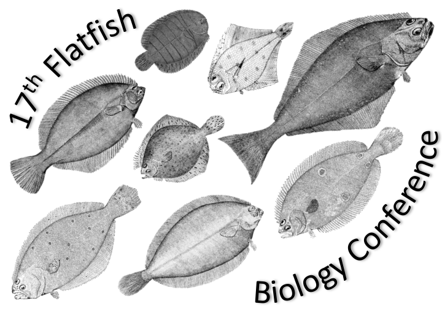

```{r setup, include=FALSE}
knitr::opts_chunk$set(echo = TRUE)
library(blastula)
library(rstudioapi)
devtools::source_gist(
  "c83e078bf8c81b035e32c3fc0cf04ee8", 
  filename = 'render_toc.R'
  )
```

<center> 
<font size="24"> **SNEC Newsletter** </font>

<font size="5"> *`r Sys.Date()` * </font>


</center>

<font size="5"> **SNEC President's Message** </font>

```{r toc, echo=FALSE} 
render_toc(getSourceEditorContext()$path)
```

## SNEC Committee Reports 

## Student Subunit Reports 

## Announcements

----------

### SNEC Summer Meeting 2022

> June 21, 2022
URI Bay Campus, Narragansett, RI

We are excited to announce we will be holding our Summer 2022 Science Meeting on June 21, at the URI Bay Campus, following our traditional meeting format. Abstract submission is OPEN!!! You can submit your abstract [here](https://nam10.safelinks.protection.outlook.com/?url=https%3A%2F%2Fdocs.google.com%2Fforms%2Fd%2Fe%2F1FAIpQLScJOKzP8Kz2IvZl7yjUvXHZcZIMge6WPVq60H7q4K8ZuaIMqw%2Fviewform&data=04%7C01%7C%7Cf2fb4d1caa8946aec53808da1bab730b%7C17f1a87e2a254eaab9df9d439034b080%7C0%7C0%7C637852720416740708%7CUnknown%7CTWFpbGZsb3d8eyJWIjoiMC4wLjAwMDAiLCJQIjoiV2luMzIiLCJBTiI6Ik1haWwiLCJXVCI6Mn0%3D%7C3000&sdata=ku5oz9c2R%2FDj8VeUpsERMIBP1vhdTAVIfAZ4w3%2BLjZs%3D&reserved=0) - abstract submission will close on *FRIDAY, JUNE 3*. 

Stay tuned for registration info!!

----------

### Seventeenth Flatfish Biology Conference

> November 15-16, 2022
Water’s Edge Resort & Spa, Westbrook, CT



The Flatfish Biology Conference welcomes platform and poster presentations addressing any aspect of flatfish research (e.g., biology, ecology, aquaculture, stock assessment, physiology, etc.) from all regions. Professional and student flatfish researchers are invited to participate.

For more information, please visit our [website](https://www.fisheries.noaa.gov/new-england-mid-atlantic/outreach-and-education/flatfish-biology-conference) or contact any of the conference co-chairs:

- [Steve Dwyer](stephen.m.dwyer@dominionenergy.com)
- [Elizabeth Fairchild](elizabeth.fairchild@unh.edu)
- [Renee Mercaldo-Allen](renee.mercaldo-allen@noaa.gov)

----------

### NED and SNEC Fisheries and Aquatic Resources Meeting Call for Symposia

> Fisheries and Aquatic Resources Meeting
January 8-10, 2023
Boston Hyatt Regency

Mark your calendar for an exciting opportunity to network and learn about innovative fisheries research being conducted in the northeastern region of North America and beyond! The Northeastern Division and Southern New England Chapter of the American Fisheries Society are hosting a joint meeting in Boston at the Boston Hyatt Regency from January 8th to 10th, 2023. The meeting will consist of a full day of workshops and two days of presentations, including keynote speakers and student awards. Three research talk sessions will run concurrently throughout the meeting, including a special session titled Diadromous Fishes: New Tools, New Findings, New Hope. 

The Program Committee invites proposals for symposia for both the general AFS/SNEC meeting and for the diadromous fish session. An organized symposium is a series of integrated presentations that address aspects of a common topic or theme. A symposium may consist of invited speakers or be opened to accept presentations from the general call for abstracts.

The Program Committee also encourages organizers to submit creative proposals for innovative sessions that utilize novel designs, approaches, and formats. Such sessions might include lightning presentations, interactive activities, or creative interdisciplinary collaborations.

All symposium proposals should be submitted via email to SNECmeetings@gmail.com by June 15th, 2022. Upon review, the Program Committee may request revisions or collaborations to reduce overlap in subject matter and strengthen individual sessions. Organizers will be notified of their acceptance by the beginning of August, with a call for abstracts in September.

Please include the following information with each submission:

- Type: Symposium, innovative session
- Intended length: 1 2-hour block, half-day
- Title: Limited to 12 words
- Organizer(s): Name and contact information, submitting organizer is the point of contact
- Description: A brief session description that will be included in the program (150 words)
- Abstract: Abstracts will be limited to 350 words.

----------

## Member Submitted Content

### Student Travel Award Reflections

Check out [this slide deck](https://drive.google.com/file/d/1d20aFGcpXuj4YV1_xJo89PdbjAPP7fkz/view?usp=sharing) to learn more about the students who were recently awarded SNEC travel stipends to share their research, and what it meant to them to have this opportunity. 

----------

### Long Island Sound Study Research Grant Program: Call for Preliminary Proposals Open

__CLOSING DATE: June 6, 2022__

Connecticut Sea Grant (CTSG) and New York Sea Grant (NYSG) announce the Long Island Sound Study (LISS) extra-mural research program. The intent of this program is to fund research that will support the science-based management of Long Island Sound (LIS) and its resources, and the implementation of the LISS Comprehensive Conservation and Management Plan (CCMP).

Preliminary proposals are invited for the funding period of March 1, 2023 to February 28, 2025. Subject to available federal funding, up to $5,500,000 is expected to be available for one- or two-year projects.

A copy of the complete RFP for 2023-2025 cycle can be accessed [here](https://seagrant.uconn.edu/2022/03/21/lis-research-jointly-administered-by-ct-ny-sea-grant-programs/).

For more information, contact:

> Dr. Syma A. Ebbin, Research Coordinator

> Connecticut Sea Grant College Program University of Connecticut

> 1080 Shennecossett Road, Groton, CT  06340-6048

> Tel. (860) 405-9278, E-mail: syma.ebbin@uconn.edu

----------

## Recently Published Research 

### PAPER TITLE

> Dalton, R.M., Sheppard, J.J., Finn, J.T., Jordaan, A. and Staudinger, M.D. (2022), Phenological Variation in Spring Migration Timing of Adult Alewife in Coastal Massachusetts. Mar Coast Fish, 14: e10198. https://doi.org/10.1002/mcf2.10198

The timing of biological events in plants and animals, such as migration and reproduction, is shifting due to climate change. Anadromous fishes are particularly susceptible to these shifts as they are subject to strong seasonal cycles when transitioning between marine and freshwater habitats to spawn. We used linear models to determine the extent of phenological shifts in adult Alewife Alosa pseudoharengus as they migrated from ocean to freshwater environments during spring to spawn at 12 sites along the northeastern USA. We also evaluated broadscale oceanic and atmospheric drivers that trigger their movements from offshore to inland habitats, including sea surface temperature, North Atlantic Oscillation index, and Gulf Stream index. Run timing metrics of initiation, median (an indicator of peak run timing), end, and duration were found to vary among sites. Although most sites showed negligible shifts towards earlier timing, statistically significant changes were detected in three systems. Overall, winter sea surface temperature, spring and fall transition dates, and annual run size were the strongest predictors of run initiation and median dates, while a combination of within-season and seasonal-lag effects influenced run end and duration timing. Disparate results observed across the 12 spawning runs suggest that regional environmental processes were not consistent drivers of phenology and local environmental and ecological conditions may be more important. Additional years of data to extend time series and monitoring of Alewife timing and movements in nearshore habitats may provide important information about staging behaviors just before adults transition between ocean and freshwater habitats.
[Read the full paper..](https://doi.org/10.1002/mcf2.10198)

-----

*SNEC exists to encourage exchange of information by members of the American Fisheries Society residing or working within Massachusetts, Connecticut, and Rhode Island. Find us online:*

- [Website](https://snec.fisheries.org/)
- [Facebook](https://facebook.com/SNECAFS)
- [Twitter](https://twitter.com/snec_afs)
- [YouTube](https://www.youtube.com/channel/UCsWL2YkP5tkWs2DAXPihvPA/about)

*Submit your own newsletter content [here](https://gcc02.safelinks.protection.outlook.com/?url=https%3A%2F%2Fforms.gle%2F9dny25282o2hRWAW9&data=04%7C01%7Caarcher%40barnstablecounty.org%7C5553f580af294f062e2a08d9b8d1f7aa%7C84475217b42348dbb766ed4bbbea74f1%7C0%7C1%7C637744034233371914%7CUnknown%7CTWFpbGZsb3d8eyJWIjoiMC4wLjAwMDAiLCJQIjoiV2luMzIiLCJBTiI6Ik1haWwiLCJXVCI6Mn0%3D%7C3000&sdata=Lx14NCnMvq3gIEmmuTTgBEy%2Bh3MMFsFE%2FE1216YSy8s%3D&reserved=0)*
