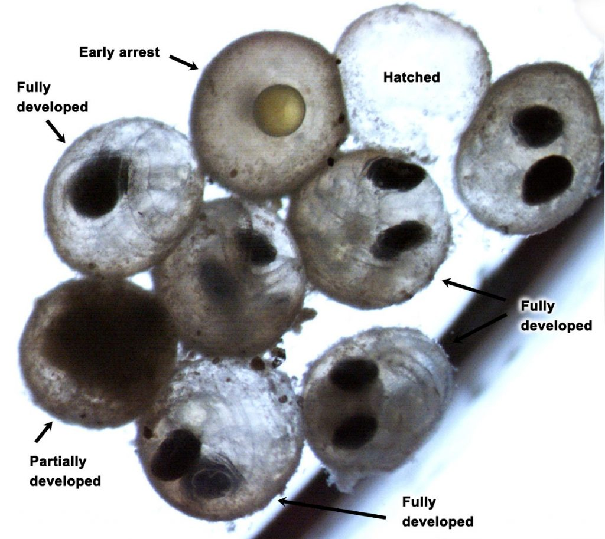

```{r setup, include=FALSE}
knitr::opts_chunk$set(echo = TRUE)
library(blastula)
library(rstudioapi)
devtools::source_gist(
  "c83e078bf8c81b035e32c3fc0cf04ee8", 
  filename = 'render_toc.R'
  )
```

<center> 
<font size="24"> **SNEC Newsletter** </font>

<font size="5"> *`r Sys.Date()` * </font>


</center>

<font size="5"> **SNEC President's Message** </font>

Happy spring fellow fisheries folks! I hope this message finds you all healthy and well. As I look out my window and contemplate this message, I am inspired by the sights I can see that signal spring is upon us. The trees have buds, the daffodils are blooming and the male gold finches at my feeder are shedding their winter plumage for the brilliant yellow breeding colors that are getting brighter and brighter each day. It is a time of new beginnings. After another long and stressful winter surrounded by SARS-CoV2 we may hopefully be entering a phase where we can safely manage our interactions with people with less fear. One sign of this potential shift towards normalcy is SNEC is planning its __first in person meeting in over 2 years!__ The Summer 2022 Science Meeting is being held __IN PERSON__ on June 21, 2022, at the URI Bay Campus. Abstract submissions are now open and you can submit your abstract [here](https://docs.google.com/forms/d/e/1FAIpQLScJOKzP8Kz2IvZl7yjUvXHZcZIMge6WPVq60H7q4K8ZuaIMqw/viewform). Abstract submission will close on Friday, June 3 so please consider presenting. We will continue to closely monitor the developing regional and state medical news surrounding SARS-CoV2 and the various states' responses to it in our region and will utilize that information to inform us should we need to adjust our conference planning. 

With our new spring beginning, field sampling for many of us has started or is starting, and we are getting to work closely with colleagues once again. For me this has been a very busy spring as we try to play catch-up. Recently the inland fisheries group of the Connecticut DEEP Fisheries Division completed a relative abundance sample for northern pike on Bantam Lake is Litchfield/Morris, CT. We used only trap nets set in early March through early April to try to capture pre-spawn northern pike as they made their way to the spawning marshes around Bantam Lake. Though ice conditions hampered some of our sampling, we were able to catch some northern pike and we should be able to compare these recent catch results with historical catch results. This sampling is being done to assess a new stocking strategy at this lake. We have been purchasing and stocking 4-6 inch fingerling northern pike from a vendor in Minnesota for a few years to see if we can obtain a stable annual number of fingerlings for stocking to supplement our varied production from our own Connecticut managed spawning marshes. All of the stocking efforts will ensure that we can continue to provide Connecticut’s anglers with trophy northern pike fisheries.

At the same time the inland fisheries group of the Connecticut DEEP Fisheries Division is performing a multi-gear population estimate (trap nets and nighttime boat electrofishing) on Mashapaug Lake in Union, CT. This sampling is being carried out to determine if our multi-year stocking strategy where we have been stocking larger (6-8 inch) walleye fingerlings, as opposed to our usual stocking strategy of smaller (4-6 inch) fingerlings, is going to pay off and create a more robust fishable population of Walleye in this lake. Water temperatures have just recently reached the point where we are starting to capture decent numbers of walleye with both gear types. As you’ll see as you peruse this newsletter there are many other professionals in SNEC that are doing some interesting things; there are links to some great work on alewives, sand lance, green crabs, and right whales.

In closing, I encourage everyone to enjoy the time they get to be out sampling with fellow colleagues this spring doing great science. Additionally, I would like to encourage you to take some time for yourself and your family. The outdoors has proven to be vitally important to people’s physical and especially mental health during the pandemic. Get outdoors and do something that energizes you. Something that fosters strong lasting memories with you, your family and your friends. I hope each of you are able to find such an outlet. Spring is a beautiful time of year.

Best wishes as we move forward into 2022!

*Chris McDowell*

*President, Southern New England Chapter of AFS*


-----

__TABLE OF CONTENTS__

```{r toc, echo=FALSE} 
render_toc(getSourceEditorContext()$path)
```

-----

## SNEC Reports 

- [Board of Directors Minutes from October 2021](https://drive.google.com/file/d/1jqQcA03y2cue5ZuwPPFWws19Nxh0jv_Y/view?usp=sharing)
- [Finance Committee 2021-Q4 and 2022-Q1](https://drive.google.com/file/d/1-TvYSrLUUsFpTAhRkI06cVo800GLQJIV/view?usp=sharing)

-----

## Announcements

### Volunteer Opportunities

- __SNEC is looking for a Professionalism Chair. Please contact anyone on the [Board of Directors](https://snec.fisheries.org/board-of-directors/) if you are interested in learning more.__

- We need judges for the SNEC Student Travel Award. Please contact [Syma Ebbin](syma.ebbin@uconn.edu) for more information. 
- Are you a professional member attending the summer meeting? Please consider volunteering to be a judge for the Best Student Presentation awards. If you're interested, contact [Syma Ebbin](syma.ebbin@uconn.edu). 

-----

### DEI Discussion Group Invitation

AFS SNEC holds a monthly discussion on topics related to Diversity, Equity, and Inclusion within the fields of fisheries science, management, and outreach. Everyone is welcome to attend. You can drop in for just one discussion, or tune in every month.

You do not need to have any expertise in DEI topics in order to attend – you just need a desire to learn.

The AFS SNEC DEI Discussions take place on the third Thursday of every month at 2PM via Zoom. Upcoming dates are May 19, June 16, and July 21.  The Zoom link will be sent out via the AFS SNEC and AFS NED listservs.

SNEC member Dr. Lian Guo started this discussion group in 2021 and wrote an [article on Page 15 of the Spring 2021 Northeastern Division Newsletter](https://ned.fisheries.org/wp-content/uploads/sites/55/2021/06/NED_Newsletter_Spring2021_Online.pdf) describing the reasons for starting the effort. Our meetings include:

- Reviewing resources that will help the American Fisheries Society to be a diverse, equitable, and inclusive professional society
- Increasing our awareness of social inequities in fisheries
- Discussing our thoughts and brainstorming steps our chapter could take to address the issues presented

Anyone can facilitate a monthly discussion and/or propose articles to read, videos to watch, or podcasts to listen to.  If you’d like to facilitate but need help coming up with a discussion topic, we can help with that.

To see past topics discussed and access the articles and podcasts that have been suggested, check out the [DEI page on the SNEC website](https://snec.fisheries.org/dei/)

To learn more about AFS-wide DEI efforts, check out the [AFS Equal Opportunities Section website](https://equalopportunity.fisheries.org/) and the [AFS Diversity, Equity, and Inclusion Committee webpage](https://diversity.fisheries.org/diversity-equity-and-inclusion-committee/)

-----

### SNEC Summer Meeting 2022

> June 21, 2022
URI Bay Campus, Narragansett, RI

We are excited to announce we will be holding our Summer 2022 Science Meeting on June 21, at the URI Bay Campus, following our traditional meeting format. Abstract submission is OPEN!!! You can submit your abstract [here](https://nam10.safelinks.protection.outlook.com/?url=https%3A%2F%2Fdocs.google.com%2Fforms%2Fd%2Fe%2F1FAIpQLScJOKzP8Kz2IvZl7yjUvXHZcZIMge6WPVq60H7q4K8ZuaIMqw%2Fviewform&data=04%7C01%7C%7Cf2fb4d1caa8946aec53808da1bab730b%7C17f1a87e2a254eaab9df9d439034b080%7C0%7C0%7C637852720416740708%7CUnknown%7CTWFpbGZsb3d8eyJWIjoiMC4wLjAwMDAiLCJQIjoiV2luMzIiLCJBTiI6Ik1haWwiLCJXVCI6Mn0%3D%7C3000&sdata=ku5oz9c2R%2FDj8VeUpsERMIBP1vhdTAVIfAZ4w3%2BLjZs%3D&reserved=0) - abstract submission will close on *FRIDAY, JUNE 3*. 

Stay tuned for registration info!!

----------

### Seventeenth Flatfish Biology Conference

> November 15-16, 2022
Water’s Edge Resort & Spa, Westbrook, CT


The Flatfish Biology Conference welcomes platform and poster presentations addressing any aspect of flatfish research (e.g., biology, ecology, aquaculture, stock assessment, physiology, etc.) from all regions. Professional and student flatfish researchers are invited to participate.

For more information, please visit our [website](https://www.fisheries.noaa.gov/new-england-mid-atlantic/outreach-and-education/flatfish-biology-conference) or contact any of the conference co-chairs:

- [Steve Dwyer](stephen.m.dwyer@dominionenergy.com)
- [Elizabeth Fairchild](elizabeth.fairchild@unh.edu)
- [Renee Mercaldo-Allen](renee.mercaldo-allen@noaa.gov)

----------

### NED and SNEC Fisheries and Aquatic Resources Meeting Call for Symposia

> Fisheries and Aquatic Resources Meeting
January 8-10, 2023
Boston Hyatt Regency

Mark your calendar for an exciting opportunity to network and learn about innovative fisheries research being conducted in the northeastern region of North America and beyond! The Northeastern Division and Southern New England Chapter of the American Fisheries Society are hosting a joint meeting in Boston at the Boston Hyatt Regency from January 8th to 10th, 2023. The meeting will consist of a full day of workshops and two days of presentations, including keynote speakers and student awards. Three research talk sessions will run concurrently throughout the meeting, including a special session titled Diadromous Fishes: New Tools, New Findings, New Hope. 

The Program Committee invites proposals for symposia for both the general AFS/SNEC meeting and for the diadromous fish session. An organized symposium is a series of integrated presentations that address aspects of a common topic or theme. A symposium may consist of invited speakers or be opened to accept presentations from the general call for abstracts.

The Program Committee also encourages organizers to submit creative proposals for innovative sessions that utilize novel designs, approaches, and formats. Such sessions might include lightning presentations, interactive activities, or creative interdisciplinary collaborations.

All symposium proposals should be submitted via email to SNECmeetings@gmail.com by June 15th, 2022. Upon review, the Program Committee may request revisions or collaborations to reduce overlap in subject matter and strengthen individual sessions. Organizers will be notified of their acceptance by the beginning of August, with a call for abstracts in September.

Please include the following information with each submission:

- Type: Symposium, innovative session
- Intended length: 1 2-hour block, half-day
- Title: Limited to 12 words
- Organizer(s): Name and contact information, submitting organizer is the point of contact
- Description: A brief session description that will be included in the program (150 words)
- Abstract: Abstracts will be limited to 350 words.

----------

## Member Submitted Content

### Under Ocean Acidification, Embryos of a Key Forage Fish Struggle to Hatch

Elaina Hancock described how a potential ripple effect from carbon in the atmosphere could have severe impacts throughout the ocean ecosystem in UConn Today. Read the full article [here](https://today.uconn.edu/2022/04/under-ocean-acidification-embryos-of-a-key-forage-fish-struggle-to-hatch/).



-----

### Student Travel Award Reflections

Check out [this slide deck](https://drive.google.com/file/d/1d20aFGcpXuj4YV1_xJo89PdbjAPP7fkz/view?usp=sharing) to meet Sarah Weisberg and Colby Peters. Sarah and Colby were both recent recepients of SNEC travel stipends, which allowed them to travel to share their research with other fisheries professionals. Learn more about these two early-career scientists, their work, and what receiving the SNEC travel stipend meant to them. A big thanks goes out to our dues paying members who provide the financial support for these awards!

-----

### View Screening for documentary, Last of the Right Whales

Leah Baumwell has been involved with the documentary, Last of the Right Whales, as an impact campaign partner to help shape messages in the film and actions that the public can take after the film gets distributed more broadly. They are hosting a screening of the film in Portland, Maine on April 27th which includes a Q&A panel (fishermen, scientists, NGOs) that Leah will be moderating to help inform the audience. Leah encourages any members in the area to attend. 

-----

### River Herring: Bringing the Ocean to New England's Freshwater by Abigail Archer

In December, Abigail Archer, Fisheries & Aquaculture Specialist with Woods Hole Sea Grant and Cape Cod Cooperative Extension, gave an outreach talk as part of the Cape Cod Maritime Museum's lecture series. The title is "River Herring: Bringing the Ocean to New England's Freshwater" and can be viewed [here](https://www.facebook.com/watch/live/?ref=watch_permalink&v=1058508541617377)


----------

### Long Island Sound Study Research Grant Program: Call for Preliminary Proposals Open

__CLOSING DATE: June 6, 2022__

Connecticut Sea Grant (CTSG) and New York Sea Grant (NYSG) announce the Long Island Sound Study (LISS) extra-mural research program. The intent of this program is to fund research that will support the science-based management of Long Island Sound (LIS) and its resources, and the implementation of the LISS Comprehensive Conservation and Management Plan (CCMP).

Preliminary proposals are invited for the funding period of March 1, 2023 to February 28, 2025. Subject to available federal funding, up to $5,500,000 is expected to be available for one- or two-year projects.

A copy of the complete RFP for 2023-2025 cycle can be accessed [here](https://seagrant.uconn.edu/2022/03/21/lis-research-jointly-administered-by-ct-ny-sea-grant-programs/).

For more information, contact:

> Dr. Syma A. Ebbin, Research Coordinator

> Connecticut Sea Grant College Program University of Connecticut

> 1080 Shennecossett Road, Groton, CT  06340-6048

> Tel. (860) 405-9278, E-mail: syma.ebbin@uconn.edu

----------

## Recently Published Research 

### Phenological Variation in Spring Migration Timing of Adult Alewife in Coastal Massachusetts

> Dalton, R.M., Sheppard, J.J., Finn, J.T., Jordaan, A. and Staudinger, M.D. (2022), Phenological Variation in Spring Migration Timing of Adult Alewife in Coastal Massachusetts. Mar Coast Fish, 14: e10198. https://doi.org/10.1002/mcf2.10198

The timing of biological events in plants and animals, such as migration and reproduction, is shifting due to climate change. Anadromous fishes are particularly susceptible to these shifts as they are subject to strong seasonal cycles when transitioning between marine and freshwater habitats to spawn. We used linear models to determine the extent of phenological shifts in adult Alewife Alosa pseudoharengus as they migrated from ocean to freshwater environments during spring to spawn at 12 sites along the northeastern USA. We also evaluated broadscale oceanic and atmospheric drivers that trigger their movements from offshore to inland habitats, including sea surface temperature, North Atlantic Oscillation index, and Gulf Stream index. Run timing metrics of initiation, median (an indicator of peak run timing), end, and duration were found to vary among sites. Although most sites showed negligible shifts towards earlier timing, statistically significant changes were detected in three systems. Overall, winter sea surface temperature, spring and fall transition dates, and annual run size were the strongest predictors of run initiation and median dates, while a combination of within-season and seasonal-lag effects influenced run end and duration timing. Disparate results observed across the 12 spawning runs suggest that regional environmental processes were not consistent drivers of phenology and local environmental and ecological conditions may be more important. Additional years of data to extend time series and monitoring of Alewife timing and movements in nearshore habitats may provide important information about staging behaviors just before adults transition between ocean and freshwater habitats.

[Read the full paper..](https://doi.org/10.1002/mcf2.10198)

-----

### Seasonal Movements of Green Crabs Revealed by Acoustic Telemetry

> Zarrella-Smith, K.A., Woodall, J.N., Ryan, A., Furey, N.B., Goldstein, J.S. (2022), Seasonal estuarine movements of green crabs revealed by acoustic telemetry. Mar Ecol Prog Ser 681:129-143. https://doi.org/10.3354/meps13927

Green crabs *Carcinus maenas* are considered among the most influential invasive species in temperate estuaries worldwide. Yet management can be hindered by the lack of high-resolution data on green crab movement ecology. We addressed this knowledge gap by coupling passive acoustic telemetry and water quality monitoring to examine daily and seasonal movements of individual green crabs in the Webhannet River Estuary (Maine, USA). We tracked 22 adult green crabs (mean [±SD] carapace width = 63.8 ± 6.5 mm) between 2 successive tagging deployments from July 2018-January 2019, with one receiver maintained until mid-April 2019. Overall, our study demonstrated the viability of using acoustic telemetry to assess seasonal movements of green crabs, with an average (±SE) individual detection rate of 27.9 ± 2.8 detections h-1 from July-January. Most crabs remained localized to very specific regions of the estuary, with each region representing a 300-600 m linear distance. Logistic regression models indicated that movements by green crabs to the downstream area were associated with a shift in temperature below 10°C, regardless of sex. From January-April 2019, 9 crabs were found to overwinter in the downstream area, potentially taking refuge in deeper waters. Movement patterns identified in this study further contribute to our understanding of the distances traveled and the areas used by green crabs, as well as further resolve overwintering behavior with consequences for mortality risk due to low temperatures. This additional knowledge of adult green crab movement and dispersal dynamics is valuable to resource managers considering intervention strategies.

[Read the full paper...](https://doi.org/10.3354/meps13927)

-----

### Angler Choices That Help Catch Lots of Big Fish

> Bade, A.P., Dippold, D.A., Schmidt, B.A., DuFour, M.R., Hartman, T.J. and Ludsin, S.A. (2022), Angler Choices That Help Catch Lots of Big Fish. Fisheries. https://doi.org/10.1002/fsh.10722

A primary goal of fisheries management is to maximize angler satisfaction (e.g., by catching more and bigger fish), while maintaining sustainable populations. In addition to environmental and ecological factors, angler choices may influence recreational catches. Using interviews (92,838) from Walleye Sander vitreus anglers in Lake Erie during 1989–2017, we identified how angler behavior influences catch outcomes. Angler behaviors were associated with changes in catch rate and the length of harvested fish. For example, trolling resulted in a 50% increase in median catch and a 24-mm increase in length, relative to casting. Other behaviors led to tradeoffs between catch rate and size, such as the time of year anglers fished. We identified behaviors that maximize fishing success with respect to anglers’ desired catch outcomes. Our results can help increase angler satisfaction by providing realistic catch expectations, given the environmental and fishery conditions, while improving recreational catch outcomes through more informed angler decision making.

[Read the full paper...](https://doi.org/10.1002/fsh.10722)

-----

### Update on the Spatial Distribution of Butterfish, 1982-2019

> Adams, C. F. 2022. Update on the Spatial Distribution of Butterfish, 1982-2019. https://doi.org/10.25923/r0p0-ty08

This document updates a prior analysis of the spatial distribution of butterfish (*Peprilus triacanthus*) in the Northwest Atlantic Ocean with 6 additional years of Northeast Fisheries Science Center (NEFSC) spring and fall bottom trawl survey data. The primary findings are that there was a significant increase in area occupancy for all ages of butterfish over the spring time series, as well as a significant increase in area occupancy for age 0 butterfish in the fall, due in part to a range expansion into the Gulf of Maine. It is recommended that inclusion of the NEFSC spring bottom trawl survey data in the assessment model should be considered in the upcoming research track, as well as Gulf of Maine and outer Georges Bank strata.

[Read the full paper..](https://doi.org/10.25923/r0p0-ty08)

-----

### Serious Injury Determinations for Small Cetaceans and Pinnipeds Caught in Commercial Fisheries off the Northeast U.S. Coast, 2015-2019

> Josephson, E. 2022. Serious Injury Determinations for Small Cetaceans and Pinnipeds Caught in Commercial Fisheries off the Northeast U.S. Coast 2015-2019. https://doi.org/10.25923/sgbq-m146

The Marine Mammal Protection Act (MMPA) requires the National Marine Fisheries Service (NMFS) to estimate annual levels of human-caused mortality and serious injury to marine mammal stocks (section 117) and to categorize commercial fisheries based on their level of incidental mortality and serious injury of marine mammals (section 118). Serious injury (SI) determinations were addressed at NMFS-convened workshops in 1997 and 2007 (Angliss and DeMaster 1998; Andersen et al. 2008), and in January 2012, the agency published new national guidelines for distinguishing serious from non-serious injuries of marine mammals (National Policy for Distinguishing…2012). A major goal of the new guidelines was to establish national consistency and transparency in SI determinations. To implement the new guidelines, Science Center SI determination (SID) staff are required to annually review the observer (OBS) and at-sea monitor (ASM) records on all incidentally caught marine mammals that were released alive. Determinations made on these fishery interactions are independently reviewed by another center’s SID (e.g., Northeast Fisheries Science Center [NEFSC] determinations are sent to the Southwest Fisheries Science Center [SWFSC], the Greater Atlantic Regional Fisheries Office [GARFO], and the Atlantic Scientific Review Group [ASRG] before final determinations are published in this document).

[Read the full paper...](https://library.oarcloud.noaa.gov/noaa_documents.lib/NMFS/NEFSC/NEFSC_reference_document/NEFSC_RD_22_03.pdf)

-----

###  Report of the Workshop: Optimizing the Research Intern Experience to Build Inclusion and Diversity in the Geosciences Workforce.

> Joyce, P., P. Chigbu, A. Jearld, H. Kite-Powell, G. Liles, and K. Chu. 2021. Report of the Workshop: Optimizing the Research Intern Experience to Build Inclusion and Diversity in the Geosciences Workforce. https://doi.org/10.25923/zhv5-6729

In celebration of the 10th anniversary of the Partnership Education Program (PEP) in Woods Hole, MA, a workshop was held from June 27-29, 2019, to discuss ways to increase diversity and inclusion in the geosciences workforce. The Workshop brought together former interns, administrators of research internship programs, and directors of scientific organizations to share perspectives on how well current research internship programs are working and what can be done to make them more supportive and more effective in encouraging members of underrepresented minorities to pursue careers in the geosciences. The Workshop focused on two topics: (1) identifying potential roadblocks that discourage minority students from entering the geosciences and (2) identifying steps that can be taken to help students overcome those roadblocks. There are many such roadblocks, and not all of them can be solved by the research institution. However, there are often ways an institution can structure a research internship program so it is a more positive, inclusive experience.

[Read the full paper...](https://doi.org/10.25923/zhv5-6729)

-----

### Serious Injury and Mortality Determinations for Baleen Whale Stocks along the Gulf of Mexico, United States East Coast, and Atlantic Canadian Provinces, 2015-2019

> Henry, A. 2022. Serious Injury and Mortality Determinations for Baleen Whale Stocks along the Gulf of Mexico, United States East Coast, and Atlantic Canadian Provinces, 2015-2019. https://doi.org/10.25923/nfr5-7r84

Opportunistic reports were used to calculate rates of human-caused serious injury and mortality to baleen whale stocks along the Gulf of Mexico, United States east coast, and Atlantic Canadian provinces from 2015 through 2019. All available information for reported whale injury and mortality events was evaluated by using established criteria to assign injury severity and cause of injury or death for each event. The average annual rate of detected human-caused serious injury and mortality during the period was 7.65 for North Atlantic right whales (*Eubalaena glacialis*), 16.25 for Gulf of Maine humpback whales (*Megaptera novaeangliae*), 1.85 for western North Atlantic fin whales (*Balaenoptera physalus*), 10.35 for Canadian east coast minke whales (*B. acutorostrata*), 0.6 for Nova Scotian sei whales (*B. borealis*), and 0 for western North Atlantic blue whales (*B. musculus*) and northern Gulf of Mexico Bryde’s whales (*B. edeni*). The number of serious injuries and mortalities not reported is unknown, and actual levels may be much higher.

[Read the full paper...](https://doi.org/10.25923/nfr5-7r84)

-----
*SNEC exists to encourage exchange of information by members of the American Fisheries Society residing or working within Massachusetts, Connecticut, and Rhode Island. Find us online:*

- [Website](https://snec.fisheries.org/)
- [Facebook](https://facebook.com/SNECAFS)
- [Twitter](https://twitter.com/snec_afs)
- [YouTube](https://www.youtube.com/channel/UCsWL2YkP5tkWs2DAXPihvPA/about)

*Submit your own newsletter content [here](https://gcc02.safelinks.protection.outlook.com/?url=https%3A%2F%2Fforms.gle%2F9dny25282o2hRWAW9&data=04%7C01%7Caarcher%40barnstablecounty.org%7C5553f580af294f062e2a08d9b8d1f7aa%7C84475217b42348dbb766ed4bbbea74f1%7C0%7C1%7C637744034233371914%7CUnknown%7CTWFpbGZsb3d8eyJWIjoiMC4wLjAwMDAiLCJQIjoiV2luMzIiLCJBTiI6Ik1haWwiLCJXVCI6Mn0%3D%7C3000&sdata=Lx14NCnMvq3gIEmmuTTgBEy%2Bh3MMFsFE%2FE1216YSy8s%3D&reserved=0)*
