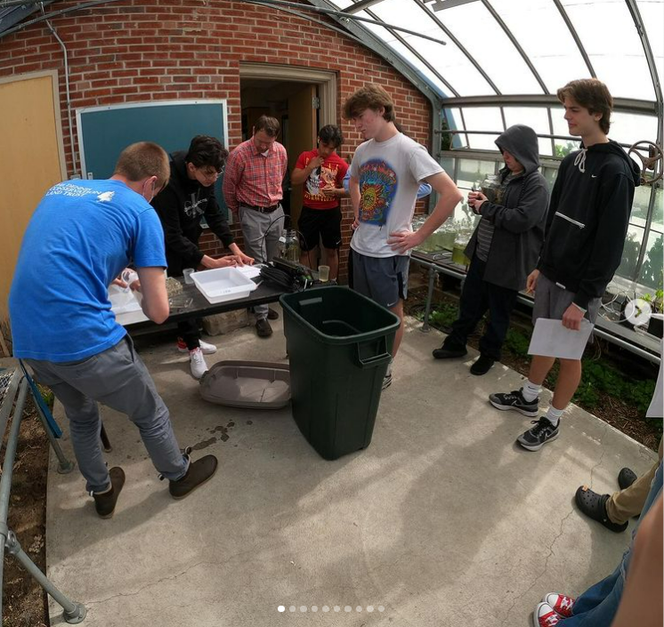

```{r setup, include=FALSE}
knitr::opts_chunk$set(echo = FALSE)
library(blastula)
library(rstudioapi)
# devtools::source_gist(
#   "c83e078bf8c81b035e32c3fc0cf04ee8", 
#   filename = 'render_toc.R'
#   )
```

<center> 
<font size="24"> **SNEC Newsletter** </font>

<font size="5"> *`r Sys.Date()` * </font>


</center>

<font size="5"> **SNEC President's Message** </font>

Dear Friends and Colleagues,
I am humbled and privileged to assume the role of President of SNEC. I am grateful to my predecessor, Christopher McDowell for his leadership and contributions to SNEC during his presidency, and the members of the Executive Committee and Board. I have been inspired by their commitment to SNEC and all of their achievements and I look forward to continuing the chapters work by encouraging the exchange of information by members of the Society.
I recognize that times have been challenging on us all, as we continue to navigate a world surround by COVID and subvariants, and for some, adjusting to a return to office work policy. I hope you and your families continue to stay safe, well and healthy! This June provided a sense of relief and normalcy for our chapter, with our first SNEC in person summer meeting in over 2 years! This meeting had excellent presentations that highlighted current research being done throughout the region, and provided an opportunity to network and connect in person with each other. Thank you to those in attendance!
For many of us, spring and summer is an exciting time. It is the start of field season, and a chance for us to leave our homes and offices for more exciting work on the water or in the field! This spring, for me, involved leading a gillnet offshore wind fisheries monitoring survey south of Rhode Island. Working with commercial fishermen, we set large-mesh gillnets from April-June to capture monkfish and winter skate. This sampling is conducted to assess the seasonal abundance, and distribution of monkfish and winter skate for two years prior to construction and installation of offshore wind turbines. 
Living on Cape Cod is always a busy time especially during the summer! For most, summers on Cape Cod mean lots of beach days and sunshine, family vacations, boat rides, ferries to the Vineyard, looking for great white sharks, lobster rolls, and a whole heck of traffic! But for me, it means spending time with friends and family, kayak fishing for scup, seabass and striped bass, supporting local businesses, eating ice cream, and filling my belly with seasonal and local seafood! I hope you each have a wonderful and safe summer, and I encourage you to stop and enjoy the diversity of local seafood that is available this time of year.
In closing, I hope as President I will continue to support and encourage participation from fishery stakeholders at our meetings, and give them a space to share their wisdom and background on various fisheries related issues, so that as scientists we can work together towards more sustainable and effective solutions. In addition, I hope to continue DEI efforts currently underway by the chapter and national society to create a more inclusive community for our membership.  Feel free to reach out to me, the Executive Committee, or Board of Directors if you have ideas or would like to get involved. 

*Aubrey Ellertson*

*President, Southern New England Chapter of AFS*


*Figure 1 -- SNEC President Aubrey Ellertson in the field*

## Announcements 

- Congratulations to our very own Dr. Alex Haro for receiving the Fish Passage Conference's [Career Achievement Reward](https://fishpassage.fisheries.org/awards/) for influential contributions to the field of fish passage that have enhanced fisheries resources. This award is given in consideration of his length of service with the USGS, contributions to the field of fish passage, imagination and innovation, outreach activities, support for interdisciplinary efforts, and leadership. 

- [Check out the SNEC website for the most up to date meeting on our January 2023 joint meeting with the Northeast Division in Boston](https://snec.fisheries.org/january-2023-mtg/) The theme of the meeting will be [__Diadromous Fishes: New Tools, New Findings, New Hope__](https://snec.fisheries.org/wp-content/uploads/2022/07/NED_Notice-25-Feb-2022.pdf)

- The SNEC Diversity, Equity, and Inclusion (DEI) discussion group meets on the third Thursday of every month from 2 PM - 3 PM via Zoom. We'd love to see you at our next meeting on September 15th. For more information, please email [Abigail Archer](aarcher@barnstablecounty.org)

- We now have a website for back issues of the newsletter. Check it out [here](https://snec.fisheries.org/newsletter/)

- Calling all ecosystem analysts: The Northeast Fisheries Science Center Plankton Dataset from the Northeast U.S. Continental Shelf is freely available online [here](https://www.fisheries.noaa.gov/resource/data/ecosystem-monitoring-northeast-us-continental-shelf-plankton-dataset). Plankton data can help us: estimate how many fish were in an area to spawn, see how populations are shifting or changing their habitat due to environment change and other stressors, and understand the state of our marine ecosystems. The NEFSC collects, maintains, and makes available the most comprehensive plankton dataset for the Northeast U.S. shelf and surrounding areas.

## Member Submitted Content

### Pond Science in the Classroom

*What human activities on land are impacting our waters?*

The  [Dennis Conservation Land Trust (DCLT)](https://dennisconservationlandtrust.org/) spent an enjoyable few weeks this past month with 30 Dennis-Yarmouth High (D-Y) students in Carl DePuy's Ecology Class conducting microcosm experiments.



*Figure 2 - Dennis-Yarmouth students conducting microcosm experiments with DCLT*

The goal of the DCLT's multi-year “Water Initiative” project, which includes some students working in the field on DCLT lands this summer, is for participants (both youth and adults) to get real science experiences and come to understand the ways in which our activities on land can impact the waters upon which all Cape Codders depend.

The DCLT thanks supporters of our Water Initiative - Cape Cod Five, Cape Cod Foundation, and the Horizon Foundation - as well as UConn’s Department of Ecology and Evolutionary Biology and the Provincetown Center for Coastal Studies for donated equipment.

For the full photo gallery, check out [DCLT on Instagram](https://www.instagram.com/p/Cef8Bq1OO5P/?utm_source=ig_web_copy_link)

### Mass DMF Partners with Commercial Fishermen to Monitor Low Dissolved Oxygen in Cape Cod Bay

During late summer 2019 and 2020, bottom waters in southern Cape Cod Bay (CCB) became depleted of dissolved oxygen (DO). Bottom DO levels became severely hypoxic (<2mg/L) in water depths from 10 to 25 m (~30–80 ft) from west of the Cape Cod Canal east to Barnstable Harbor. In mid-September 2019, there were numerous reports of dead lobsters and scallops from the local fishing community indicating that DO levels had dropped to lethal levels in this region. In response to this unprecedented event, DMF began working with other scientists and the local lobster fleet to begin to understand what was driving hypoxia in southern CCB. As part of this effort the Massachusetts Lobster Foundation, in collaboration with DMF, created the Cape Cod Bay Study Fleet, which has provided oxygen probes to a number of lobster fishers in the region. These small probes are deployed in lobster pots and provide near real-time measurements of bottom DO. The goal of this program is to monitor bottom DO throughout CCB and alert the public when low DO conditions begin to develop.

[Read the full story here...](https://www.mass.gov/news/monitoring-and-understanding-low-dissolved-oxygen-in-cape-cod-bay)

[Check out some graphical representations of the data here...](https://www.mass.gov/info-details/tracking-dissolved-oxygen-with-the-cape-cod-bay-study-fleet-and-dmf)

.jpg)

*Figure 4 -- A dissolved oxygen probe installed on a lobster trap*


*Figure 5 -- A Deck Data Hub (Lowell Instruments LLC., Falmouth, MA) allows fishermen to see the dissolved oxygen and temperature data collected on their gear and transmits data back to scientists at DMF and NOAA in near real time*

### Pictures from the field


*Figure 5 -- Katrina Zarrella Smith setting out on a shallow-water trip for her weekly beam trawl survey of YOY winter flounder in Boston Harbor*


*Figure 6 -- The crew of the F/V Nathaniel Lee fishing out of Newport, RI prepares to deploy two ocean drifters built by high school students at Seton Hall Academy in New Jersey near the edge of the continental shelf. Students will be able to track the drifters' progress in real-time [here](https://www.spotmyglobalstar.com/s/G1B4#live/assets)*


## Recently Published Research 

### Differences in the size at maturity of female American lobsters (Homarus americanus) from offshore Southern New England and eastern Georges Bank, USA

> Ellertson, A. A., J. D. Waller, T. L. Pugh, and N. D. Bethoney. 2022. Differences in the size at maturity of female American lobsters (Homarus americanus) from offshore Southern New England and eastern Georges Bank, USA. Fisheries Research 250:106276.

Female reproductive dynamics of the offshore American lobster fishery are not well understood due to the difficulties associated with biological sampling offshore. This lack of knowledge limits our understanding of population dynamics and the impacts of fishery removals on the offshore lobster resource. Addressing needs identified by stock assessment scientists, we determined the size at which female lobsters reach sexual maturity for two offshore areas (offshore Southern New England and eastern Georges Bank) utilizing data from commercial lobster gear and the Northeast Fisheries Science Center bottom trawl survey. A total of 491 female lobsters were collected and assigned a maturity status based on standard ovarian staging techniques. The size at which 50% of females in the population are mature (L50) occurred at a smaller size (L50 = 79.5 mm) in Southern New England compared to eastern Georges Bank (L50 = 91.9 mm). Comparisons of our results to historical data from nearby regions show only a slight decline in Southern New England, but, depending on the data source, a larger decline in size at maturity for Georges Bank. These maturity estimates for offshore lobsters provide new information for assessment scientists and managers on lobster population demographics in a data-poor region of the fishery, and reinforce the value achieved by working collaboratively with the fishing industry to address data gaps in the offshore lobster fishery.

[Read the full paper...](https://www.sciencedirect.com/science/article/abs/pii/S0165783622000534)

### Interdisciplinary stock identification of North Atlantic porbeagle (Lamna nasus)

> Haugen, J., G. Skomal, T. Curtis, and S. Cadrin. 2022. Interdisciplinary stock identification of North Atlantic porbeagle (Lamna nasus). Journal of Northwest Atlantic Fishery Science 53:1–18.

We conducted an interdisciplinary review of available information (i.e., genetics, life-history, and movement) to evaluate the stock structure of a previously targeted shark species, the porbeagle (Lamna nasus), in the North Atlantic. Most available information supports the conclusion that porbeagle consist of a single genetic population in the North Atlantic, which is relevant for determining species conservation status. However, the observed movement rates between the Northwest, Northeast Atlantic, and the Mediterranean appear to be low enough to consider separate spatial units for stock assessment and fishery management. The review reveals different interpretations among the organizations involved with the conservation, management, and assessments of porbeagle in the North Atlantic regarding biological population and stock boundaries. Differences in the spatial definition of management units among management organizations may pose an impediment to conserving porbeagle populations and achieving management objectives. We recommend an increased collaboration between organizations involved in highly migratory shark species as it would be beneficial for data collection, data inclusiveness, the robustness of assessments, and provide clarity for fishery managers, scientists, and the public on stocks and status. This review demonstrates that the interdisciplinary approach to stock identification is particularly valuable for data-limited species because no single approach typically has enough information to be definitive. Clearly defining management units that reflect the biological populations of porbeagle in the North Atlantic is expected to reduce uncertainty in stock assessments and help achieve current management and conservation goals of rebuilding North Atlantic porbeagle stocks.

[Read the full paper...](https://journal.nafo.int/Volumes/Articles/ID/668/Interdisciplinary-stock-identification-of-North-Atlantic-porbeagle-emLamna-nasusem)

### Recent declines in American lobster fecundity in southern New England: drivers and implications

> Goldstein, J. S., K. A. Zarrella-Smith, and T. L. Pugh. 2022. Recent declines in American lobster fecundity in southern New England: drivers and implications. ICES Journal of Marine Science 79(5):1662–1674.

Lobsters in southern New England (SNE) have experienced decades of environmental stressors along with a suite of emerging diseases. We hypothesized that the sublethal effects of physiological stress resulting from increased temperatures have contributed to a decline in reproductive investment in SNE lobsters. Using the presence of epizootic shell disease (ESD) as a proxy for stress, we examined lobster potential fecundity through the number of recently extruded, early-stage eggs and their nutritional quality; realized fecundity based on counts of late-stage eggs nearing hatch; and compared realized fecundity to historical data (1980s) from the region. Generalized linear modeling revealed that female size was a significant predictor of both potential and realized fecundity as expected, but that ESD status did not result in differences in fecundity. Dry weight was the only difference in nutritional content egg–1 between non-diseased and diseased females. There was also no relationship detected between potential fecundity and any nutritional metric from non-diseased females. However, both dry weight and protein were negatively correlated with potential fecundity in diseased females. Most importantly, realized fecundity of recent-day females was significantly reduced compared to the fecundity of historical females, characterized as a 23% decrease predicted by our model. Stressful environmental conditions, particularly temperature, may have contributed to decreased fecundity over a 30-year period in SNE. Our data demonstrate that expectations around the potential for the SNE stock to rebuild need to be adjusted to this new regime of decreased reproductive output and can no longer rely on past estimates of egg production and recruitment.

[Read the full paper...](https://academic.oup.com/icesjms/article/79/5/1662/6594655)


### An Economic Analysis of the Multispecies Catch Share Program

> Werner, S. L. 2022. An Economic Analysis of the Multispecies Catch Share Program. NEFSC Reference Document 22-11. 

This report evaluates the economic performance of the groundfish fleet over fishing years (FY) 2007-2015 to capture and compare economic trends before and after implementation of catch share management enacted under Amendment 16 to the Multispecies Fishery Management Plan (FMP) (NEFMC 2009). Economic performance is evaluated at 3 operational perspectives: the groundfish trip-, vessel-, and entity/business-level.

[Read the full paper...](https://repository.library.noaa.gov/view/noaa/43722)


### Comparative study of a bottom-set gillnet designed to reduce sea turtle bycatch in the U.S. Mid-Atlantic Monkfish gillnet fishery

> Galvez, B. A., E. Matzen, H. O. Milliken, E. Keane, and C. Upite. 2022. Comparative study of a bottom-set gillnet designed to reduce sea turtle bycatch in the U.S. Mid-Atlantic Monkfish gillnet fishery. NOAA Technical Memorandum NMFS-NE-282. 

Monkfish (Lophius americanus) is a commercially valued species that supports a lucrative fishery in the Mid-Atlantic and Northeast regions of the United States. Primarily targeted through sink gillnets and trawls, the fishery is known to incidentally catch sea turtles and Atlantic sturgeon, both of which are protected under the Endangered Species Act. Although several years of research have demonstrated that an experimental, low-profile gillnet reduces the bycatch of Atlantic sturgeon while maintaining acceptable landings of target catch, there is a lack of information on its effects on sea turtle bycatch. In this study, we compare the difference in turtle catch between a low-profile (experimental) gillnet and a standard (control) gillnet typically used in the monkfish fishery. This study was conducted off Cape Hatteras, North Carolina, from mid-February to mid-March 2021. This location is known to have high densities of loggerhead turtles (Caretta caretta) in late winter/early spring, which allowed us to collect enough turtles within reasonable time and budget constraints. Over 14 days, 68 paired hauls with an average soak time of 42 minutes were completed. The control net caught 19 loggerhead turtles, and the experimental net caught 6. Following a repeated measures design, we used generalized linear mixed models with a Poisson distribution to model the dependent variable of turtle catch numbers. Fixed effects included gear type and the environmental variables of surface temperature/bottom temperature differential, time of day, depth, and wind speed. A trip identifier was included in the model as a random effect, and soak duration was included as an offset variable. The corrected Akaike Information Criterion (cAIC) was used to find the best fit model from a model suite. The model with the single fixed effect of gear type had the lowest cAIC. The estimate of gear type indicated that the experimental net reduced turtle catch by approximately 68% compared to the control net. In addition to the model results, underwater video of loggerhead turtles interacting with the experimental net was captured.


[Read the full paper...](https://doi.org/10.25923/99qn-5b33)

### Estimation of Cetacean and Pinniped Bycatch in Northeast and Mid-Atlantic Bottom Trawl Fisheries, 2015-2019

> Lyssikatos, M.C. and S. Chavez-Rosales. 2022. Estimation of Cetacean and Pinniped Bycatch in Northeast and Mid-Atlantic Bottom Trawl Fisheries, 2015-2019. NOAA Technical Memorandum NMFS-NE-281.
 

This report provides bycatch estimates, calculated using mortality and serious injuries combined, for 5 cetacean and 3 pinniped species incidentally captured by Northeast bottom trawl (NEBT) and Mid-Atlantic bottom trawl (MABT) fishing operations from 2015-2019 (Table 1). The data presented here are an update from Lyssikatos et al. (2020; 2021) and Chavez-Rosales et al. (2018), which cover the fishing operations from 2012-2018. The bycatch estimation methodology does not differ from earlier years dating back to 2008 (Lyssikatos 2015; Chavez- Rosales et al. 2017). Stratified bycatch estimates were produced using a ratio estimator by region, year, trimester, and eco-region (Table 2). For details on the bycatch estimation methodology, please refer to recent documentation in Chavez-Rosales et al. (2018). The marine mammal species included for the 2015-2019 time period are: Atlantic white-sided dolphin (Lagenorhynchus acutus), common dolphin (Delphinus delphis delphis), common bottlenose dolphin (offshore stock; Tursiops truncatus truncatus), Risso’s dolphin (Grampus griseus), long-finned pilot whale (Globicephala melas), harbor porpoise (Phocoena phocoena phocoena), harbor seal (Phoca vitulina vitulina), harp seal (Pagophilus groenlandicus), and gray seal (Halichoerus grypus atlantica). The aim of this report is to document bycatch estimates for the 5-year period of 2015-2019 to support the U.S. Atlantic and Gulf of Mexico 2020 marine mammal stock assessment reports. Individual marine mammal stock assessment reports for the Northwest Atlantic are available online at https://www.fisheries.noaa.gov/national/marine-mammal-protection/marine-mammal-stock-assessment-reports-species-region.

[Read the full paper..](https://repository.library.noaa.gov/view/noaa/39507)

### Estimates of Cetacean and Pinniped Bycatch in the 2019 New England Sink and Mid-Atlantic Gillnet Fisheries

> Precoda, K. and C.D. Orphanides. 2022. Estimates of Cetacean and Pinniped Bycatch in the 2019 New England Sink and Mid-Atlantic Gillnet Fisheries. NEFSC Reference Document 22-05. 

This report provides estimated bycatch of 6 species of small cetaceans and pinnipeds bycaught in the New England sink gillnet (NESG) and Mid-Atlantic gillnet (MAG) fisheries. The bycatch estimation methodology approach used for these data differs only slightly from that used in prior year estimates; changes are noted in the Methods section. For additional details on the bycatch estimation methodology, please refer to Orphanides and Hatch (2017)

[Read the full paper..](https://repository.library.noaa.gov/view/noaa/39407)

-----

*SNEC exists to encourage exchange of information by members of the American Fisheries Society residing or working within Massachusetts, Connecticut, and Rhode Island. Find us online:*

- [Website](https://snec.fisheries.org/)
- [Facebook](https://facebook.com/SNECAFS)
- [Twitter](https://twitter.com/snec_afs)
- [YouTube](https://www.youtube.com/channel/UCsWL2YkP5tkWs2DAXPihvPA/about)

*Submit your own newsletter content [here](https://gcc02.safelinks.protection.outlook.com/?url=https%3A%2F%2Fforms.gle%2F9dny25282o2hRWAW9&data=04%7C01%7Caarcher%40barnstablecounty.org%7C5553f580af294f062e2a08d9b8d1f7aa%7C84475217b42348dbb766ed4bbbea74f1%7C0%7C1%7C637744034233371914%7CUnknown%7CTWFpbGZsb3d8eyJWIjoiMC4wLjAwMDAiLCJQIjoiV2luMzIiLCJBTiI6Ik1haWwiLCJXVCI6Mn0%3D%7C3000&sdata=Lx14NCnMvq3gIEmmuTTgBEy%2Bh3MMFsFE%2FE1216YSy8s%3D&reserved=0)*
