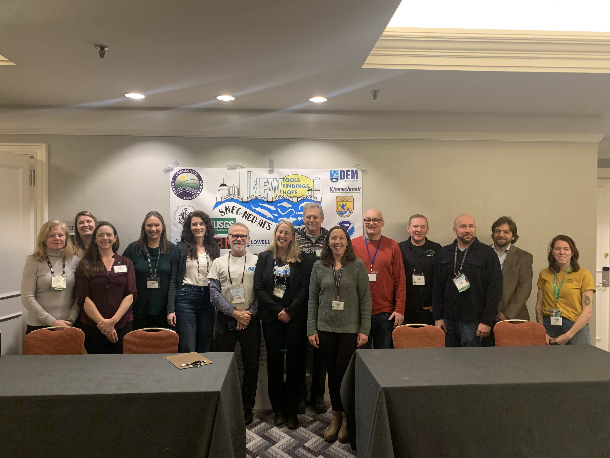
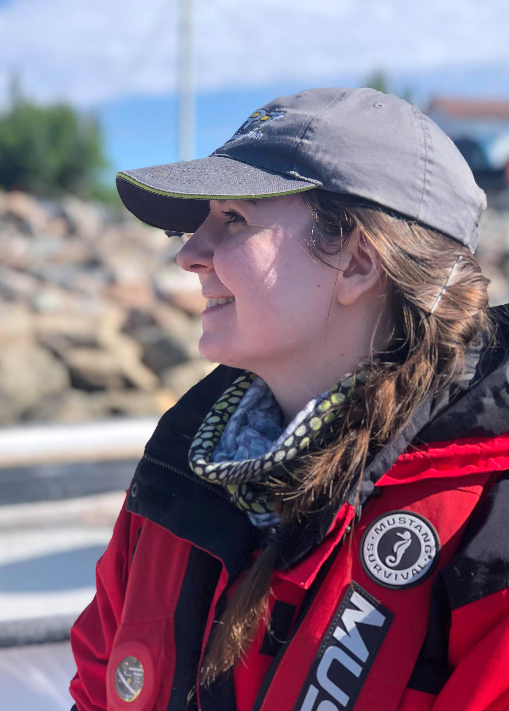
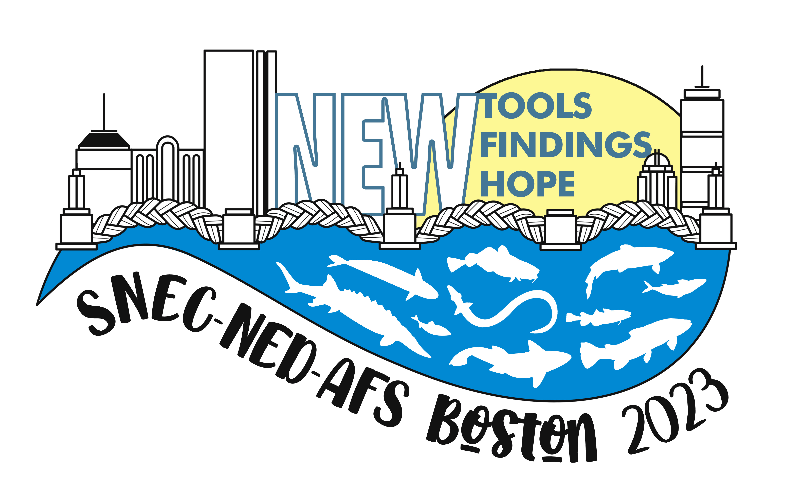
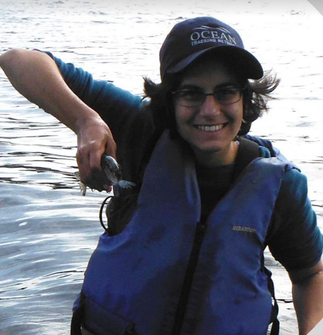
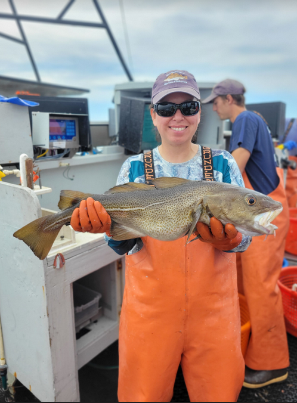
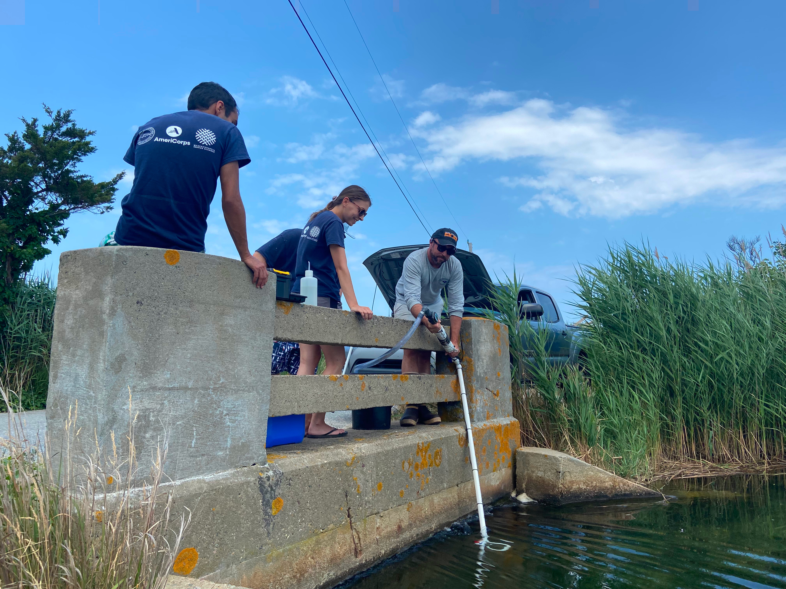
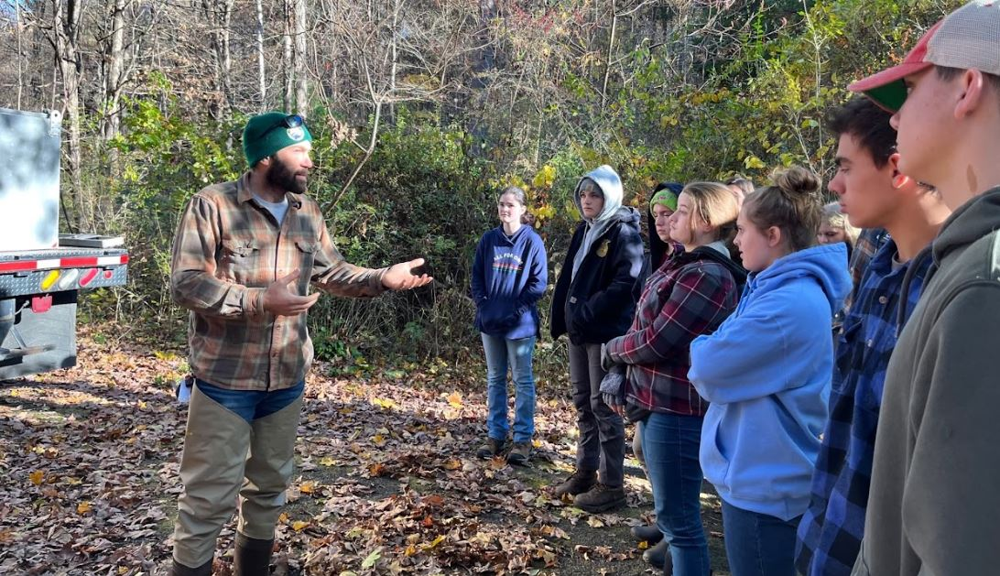
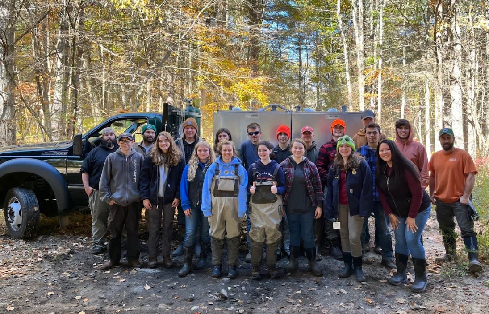
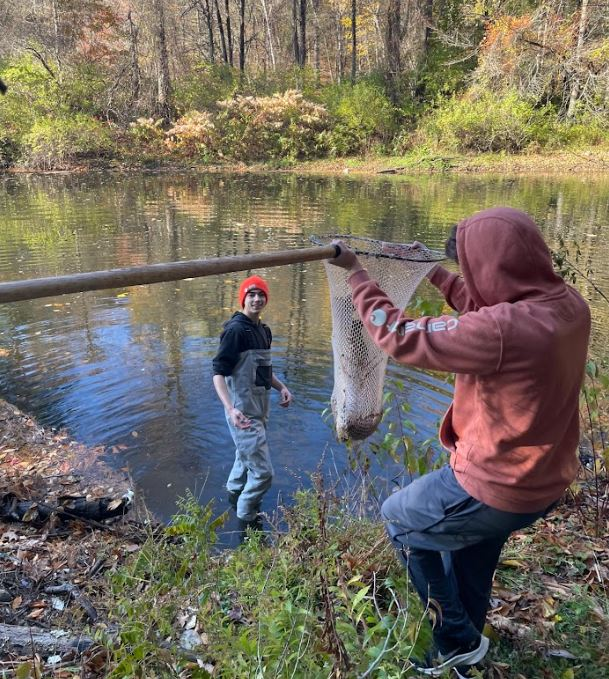

```{r setup, include=FALSE}
knitr::opts_chunk$set(echo = TRUE)
library(blastula)
library(rstudioapi)
devtools::source_gist(
  "c83e078bf8c81b035e32c3fc0cf04ee8", 
  filename = 'render_toc.R'
  )
```

<center> 
<font size="24"> **SNEC Newsletter** </font>

<font size="5"> *`r Sys.Date()` * </font>


</center>

<font size="5"> **SNEC President's Message** </font>

```{r toc, echo=FALSE} 
render_toc(getSourceEditorContext()$path)
```

## 2023 SNEC / NED Meeting Content

Thank you to all the folks who made the AFS SNEC/NED meeting in Boston possible! Three Cheers to the Planning Committee, Student Volunteers, Moderators, AV Crew, AFS HQ Staff, Poster and Oral Presenters, and Attendees. More pictures and experiences from the conference will be published in the Spring newsletter.



Thanks also to [Rachel Pomerleau](https://snec.fisheries.org/logo/) who designed the logo for this meeting. Rachel is a graduate student at Acadia University studying trace element contaminants in coastal recreational fishes in Atlantic Canada. She’s also an artist!





## 2022 AFS Annual Meeting Travel Award Recipients

Thanks to the generosity of our members, SNEC supported two students in their travels to Spokane, Washington for the AFS annual meeting last fall. 

Asha Ajmani is a PhD student at UMass Amherst and a Fellow at the Northeast Climate Adaptation Science Center. 



> *Thank you for the opportunity to attend AFS 2022. I was proud to attend a
conference that focused so much on the value of Indigenous Knowledge, Indigenous
science, and Indigenous partnerships. It is hard to work in a field where Tribal
engagement is relatively new, and it is personally frustrating and isolating to be one
of the few people at my university engaging in this work; my goals and the goals of
the Tribal community don’t often align with the standard research milestones
guiding academia. It was welcoming and rewarding to participate in a conference
where we were invited to be a part of culture and science that highlights the
Indigenous ways of life, including deep connections to culture and nature. For the
first time in a long time, I felt connected to a community that appreciates this, and I
was able to network and make connections with others working with Indigenous
communities. One idea that really stood out to me was the concept of Indigenous
methodologies and how fish are “interrogated” throughout their whole life. From
Sammy Matsaw Jr., I learned that the Wolf-Teachings promote keeping our hands
off the fish. Using light-handed methods, or methods that provide more
information with less handling of the fish, fits in with these teachings and helps
advance more quickly towards a subsistence goal. These goals are higher than the
recovery goals set by state or federal management agencies. I would like to
incorporate this light-handed methodology more intentionally into my work, as it
aligns with the concepts taught to me by my Tribal partners and with my own
personal beliefs.*

You can read more about Asha, her research, and her experience in Spokane [here](https://drive.google.com/file/d/1cBViycne1AwIGMi5BulOtZcg5MVwZwjW/view?usp=share_link). 

Katrina Zarrella Smith is a PhD Candidate in the Jordaan Fisheries and Aquatic Ecology lab at UMass Amherst. 



> *AFS Spokane was an amazing opportunity for me to debut my dissertation research to
an important audience. I view professional conferences, specifically AFS, as an
essential development tool in the research process from start to finish, and not just a
time to communicate final results. The “Bringing new perspectives to marine and
estuarine fisheries” symposium, where I gave my oral presentation, provided an
excellent platform to share plans for my research, interesting preliminary results, and
work on developing my scientific communication style. Through my talk and time at
AFS, I was able to make valuable connections with professionals and peers ─
connections that will ultimately enhance my research products and broaden my
career avenues. This award also enabled me to take advantage of the Continuing
Education courses which taught me skills that I am now applying in my modeling work.
I am also a member of the Equal Opportunities Section and AFS was a great time for
us all to come together, meet folks with similar experiences, and move forward with
new energy to take on the challenges of bringing diversity, equity, and inclusion
principles to our profession. Thank you all for this award and for supporting me as I
work to achieve my goals.*

You can read more about Katrina, her research, and her experience in Spokane [here](https://drive.google.com/file/d/1cx8H4EY_ucfpif8MWr33jliRe9CgWLUa/view?usp=share_link). 

## Center for Coastal Studies Researching Shellfish Abundance in East Harbor on Cape Cod

The Center for Coastal Studies (CCS) Marine Fisheries Research program has been working closely with scientists and students from the National Park Service Cape Cod National Seashore and Antioch University to study horseshoe crab and shellfish populations in East Harbor, also known as Pilgrim Lake, a coastal lagoon in Truro and Provincetown on the outer Cape. The construction of the railroad in the 1800s isolated East Harbor from Cape Cod Bay, now connected to the Bay only by a culvert under Route 6 and Shore Road that for years functioned only as an overflow to prevent rainwater from overfilling the lagoon and flooding the highway. An oxygen depletion and fish kill in September 2001 prompted the Town of Truro and Cape Cod National Seashore to investigate options for restoring the East Harbor system, and in the following year, the Seashore began a [tidal restoration project](https://www.nps.gov/caco/learn/nature/east-harbor-tidal-restoration-project-page.htm), allowing the tide to run in and out of the culvert. The lagoon quickly turned from brackish to estuarine/saltwater conditions and water quality improved. Fish and shellfish returned to the system relatively quickly, but in the years following the restoration, their numbers fluctuated from year to year. 


*The CCS Toyota Tacoma often served as a mobile plankton laboratory this summer. A pump sampler designed and built by Marine Fisheries Research Director Owen Nichols operated off the truck’s battery, filtering plankton from hundreds of gallons of water. Here, Nichols deploys the pump sampler as Americorps Cape Cod service members look on.*

This summer, CCS Marine Fisheries Research director Owen Nichols collected zooplankton samples as part of a study of shellfish abundance and distribution in the East Harbor system. Nichols will be analyzing these samples this winter, comparing the numbers of bivalve (two-shelled molluscs like clams and mussels) and crab larvae in samples collected on incoming and outgoing tides in order to understand factors driving changes in the abundance of shellfish and their predators (such as the invasive green crab). While the CCS Marine Fisheries Research program often works offshore with the Cape’s commercial fishing community, we frequently respond to community concerns by looking inshore at the vital habitats of our bays, marshes, and coastal lagoons. 

## CT DEEP Fall Salmon Stocking Includes High School Students

Connecticut Department of Energy and Environmental Protection fisheries biologist Matt Devine stocked salmon in the Naugatuck River with the help of eager and enthusiastic high school students from Nonnewaug High School in Woodbury, CT. It was a Natural Resource Conservation course as well as an aquaculture course. 17 students helped stock fish and learn about what we do and why here at Inland Fisheries. They were energized, asked lots of great questions, and many left asking how they could get a job with us and for additional ways to help protect the resource. These opportunities are a fantastic way to engage the public, our stakeholders, and the next generation (and they are fun!!).







## Learn More About Our Region

- UConn Today ran a feature story about research at the intersection of river herring restoration and climate change in Connecticut. You can read more about that collaborative effort between fisheries biologists and hydrologists [here](https://today.uconn.edu/2022/10/alewives-can-they-get-out/). 

- The State of the Harbor Conference in Wellfleet, MA was cosponsored by the [Friends of Herring River](https://www.friendsofherringriver.org/), [Mass Audubon](https://www.massaudubon.org/), [The Center for Coastal Studies](https://coastalstudies.org/), [The Wellfleet Conservation Trust](https://wellfleetconservationtrust.org/), and the Town of Wellfleet. It included presentations about using eDNA to track winter flounder, herring restoration, and nutrient flows in the harbor. Check out a recording of the conference [here](https://reflect-townofwellfleet.cablecast.tv/CablecastPublicSite/show/1295)

- The team behind a multi-year human dimensions research project studying attitudes to rebounding seal and shark populations among different demographic groups on Cape Cod has been busy publishing the results of their research. Check out more about the project [here](https://seagrant.whoi.edu/sealshark/). 

- Massachusetts Division of Marine Fisheries biologist John Sheppard put together a [YouTube video](https://www.youtube.com/watch?v=1JDeQDCP6go&t=11s) to go along with a recent publication he co-authored, entitled [Phenological Variation in Spring Migration Timing of Adult Alewife in Coastal Massachusetts](https://afspubs.onlinelibrary.wiley.com/doi/full/10.1002/mcf2.10198)

## Recently Published Research 

### Applied aspects of locomotion and biomechanics

> <div class="csl-entry">Castro-Santos, T., Goerig, E., He, P., &#38; Lauder, G. V. (2022). Applied aspects of locomotion and biomechanics. <i>Fish Physiology</i>, <i>39</i>, 91–140. https://doi.org/10.1016/BS.FP.2022.04.003</div>

Locomotion is the act and process of moving from place to place, which is fundamental to the life history of all mobile organisms. While the field of biomechanics encompasses the study of the physical constraints of what animals are capable of, ecological contexts require an integrated view that includes ecology and behavior. This chapter provides an overview of some of the areas where locomotion and biomechanics of fish movement interface with the rapidly evolving changes that humans impose on aquatic environments. These changes include fundamental alterations to the environment such as altered flows, fragmentation of riverine habitats, and invasive species, but also direct interactions that occur with capture fisheries. We explore each of these areas, considering both challenges and opportunities informed by the study of locomotion and biomechanics, emphasizing how this field can contribute to conservation of fishes in the Anthropocene. We then turn to technology, where important advances are aiding in our understanding of fish movement. In some cases those advances have themselves led to novel technologies, where biomimetic robots and related devices offer novel opportunities, both for conservation and for other pursuits.
[Read the full paper..](https://doi.org/10.1016/bs.fp.2022.04.003)

### Unprecedented summer hypoxia in southern Cape Cod Bay: an ecological response to regional climate change?

> <div class="csl-entry">Scully, M. E., Geyer, W. R., Borkman, D., Pugh, T. L., Costa, A., &#38; Nichols, O. C. (2022). Unprecedented summer hypoxia in southern Cape Cod Bay: an ecological response to regional climate change? <i>Biogeosciences</i>, <i>19</i>(14), 3523–3536. https://doi.org/10.5194/BG-19-3523-2022</div>

In late summer 2019 and 2020 bottom waters in southern Cape Cod Bay (CCB) became depleted of dissolved oxygen (DO), with documented benthic mortality in both years. Hypoxic conditions formed in relatively shallow water where the strong seasonal thermocline intersected the sea floor, both limiting vertical mixing and concentrating biological oxygen demand (BOD) over a very thin bottom boundary layer. In both 2019 and 2020, anomalously high sub-surface phytoplankton blooms were observed, and the biomass from these blooms provided the fuel to deplete sub-pycnocline waters of DO. The increased chlorophyll fluorescence was accompanied by a corresponding decrease in sub-pycnocline nutrients, suggesting that prior to 2019 physical conditions were unfavorable for the utilization of these deep nutrients by the late-summer phytoplankton community. It is hypothesized that significant alteration of physical conditions in CCB during late summer, which is the result of regional climate change, has favored the recent increase in sub-surface phytoplankton production. These changes include rapidly warming waters and significant shifts in summer wind direction, both of which impact the intensity and vertical distribution of thermal stratification and vertical mixing within the water column. These changes in water column structure are not only more susceptible to hypoxia but also have significant implications for phytoplankton dynamics, potentially allowing for intense late-summer blooms of Karenia mikimotoi, a species new to the area. K. mikimotoi had not been detected in CCB or adjacent waters prior to 2017; however, increasing cell densities have been reported in subsequent years, consistent with a rapidly changing ecosystem.
[Read the full paper..](https://doi.org/10.5194/BG-19-3523-2022)

### An interdisciplinary review of Atlantic Cod (Gadus morhua) stock structure in the Western North Atlantic Ocean

> <div class="csl-entry">McBride, R. S. (editor), &#38; Smedbol, R. K. (editor). (2022). <i>An Interdisciplinary Review of Atlantic Cod (Gadus morhua) Stock Structure in the Western North Atlantic Ocean</i>. https://doi.org/10.25923/SK1X-Z919</div>

An Atlantic Cod Stock Structure Working Group (ACSSWG) was formed in early 2018 to inventory and summarize all relevant peer-review information about stock structure of Atlantic cod in US and adjacent waters (i.e., NAFO management divisions 5 and 6 and interactions with 4X). In addition, new data or information could be internally reviewed by the ACSSWG for inclusion in this report. Additional feedback was gained from 3 engagement sessions, 2 sponsored by New England Fishery Management Council and New Hampshire Sea Grant and 1 sponsored by the Maine Fishermen’s Forum, each of which added local ecological knowledge into the ACSSWG deliberations.
[Read the full paper..](https://doi.org/10.25923/SK1X-Z919)

### A life history study of Atlantic Wolffish resolves bias and imprecision in length- and age-at-maturity schedules by recognizing abortive maturation

> <div class="csl-entry">McBride, R. S., Fairchild, E. A., Press, Y. K., Elzey, S. P., Adams, C. F., &#38; Bentzen, P. (2022). A Life History Study of Atlantic Wolffish Resolves Bias and Imprecision in Length- and Age-at-Maturity Schedules by Recognizing Abortive Maturation. <i>Marine and Coastal Fisheries</i>, <i>14</i>(5), e10222. https://doi.org/10.1002/MCF2.10222</div>

Stock assessments of U.S. Atlantic Wolffish Anarhichas lupus are hampered by a landings moratorium and low catches in fishery-independent surveys. Working with the commercial fishing industry, we collected hundreds of fish to overcome a lack of regionally specific life history information. Based on ages from sectioned otoliths, Atlantic Wolffish are long lived (maximum observed age: males = 31 years, females = 29 years). A Gompertz growth model showed that Atlantic Wolffish exhibit dimorphic growth—with larger males across all ages on average. Preliminary estimates of total mortality ranged from 0.15 to 0.21 and were lower than an estimate measured at the beginning of the moratorium. Based on gonad histology, a cohort of vitellogenic oocytes emerged in mature females by April and developed group synchronously to ovulate primarily in October. Skip spawning, which accounts for nonannual spawning, was observed in 5.6% of the mature females. Accounting for abortive maturation, a physiological event that delays functional maturation, improved precision and reduced bias of maturity estimates. The resulting median length at functional maturity was 53 cm total length (95% confidence interval = 49–56 cm), and the median age was 6.7 years old (6.2–7.2 years). These estimates are smaller and younger than elsewhere in the western North Atlantic Ocean, confirming that regionally specific maturity parameters are relevant when assessing reference points of the U.S. Atlantic Wolffish fishery.
[Read the full paper..](https://doi.org/10.1002/MCF2.10222)

### Evaluating growth dimorphism, maturation, and skip spawning of Atlantic halibut in the Gulf of Maine using a collaborative research approach

> <div class="csl-entry">McBride, R. S., Maynard, G. A., Elzey, S. P., Hennen, D. R., Tholke, E. K., Runnebaum, J. M., &#38; McGuire, C. H. (2022). Evaluating growth dimorphism, maturation, and skip spawning of Atlantic halibut in the Gulf of Maine using a collaborative research approach. <i>Journal of Northwest Atlantic Fishery Science</i>, <i>53</i>, 57–77. https://doi.org/10.2960/J.V53.M736</div>

The data-limited nature of Atlantic halibut (Hippoglossus hippoglossus) in U.S. waters hampers evaluation of what may be a slow but steady rebuilding pattern. Here, we collaborate with the commercial fishery to design and implement a multi-gear sampling program that collected 100s of biological samples from throughout the Gulf of Maine in a five-year period, 2014–2018. Examination of sectioned otoliths revealed a maximum age of 12 years (females) and 13 years (males); in comparison, Atlantic halibut as old as 40–50 years have been collected elsewhere in the western North Atlantic. Growth modeling confirmed sexual dimorphism, with a larger asymptotic length (L∞) for females (214 cm fork length [FL]) than males (195 cm FL). Estimates of median female length at maturity, L50, of 128 cm FL (124–132 cm, 95% confidence limits), and median female age at maturity, A50, of 9.6 years old (9.0–10.8 years), were longer and older than previous reports for the Gulf of Maine, likely resulting from our use of histological instead of macroscopic methods to classify maturity. Histology demonstrated that vitellogenesis initiated in individuals in spring, nearly a year prior to spawning, which allowed us to identify first-time (primiparous) spawners and provided the first potential evidence of skip spawning for this species. Finally, an index was developed to track the proportion of potentially mature females in the fishery, which showed an increasing trend; this qualitative tool may prove useful in a data-limited environment for evaluating the relative stock status of Atlantic halibut.
[Read the full paper..](https://doi.org/10.2960/J.V53.M736)

### Life history assessment of Cusk, a data-poor species, in U.S. waters

> <div class="csl-entry">McElroy, W. D., Tholke, E. K., Wuenschel, M. J., &#38; Robillard, E. (2022). Life History Assessment of Cusk, a Data-Poor Species, in U.S. Waters. <i>Marine and Coastal Fisheries</i>, <i>14</i>(5), e10223. https://doi.org/10.1002/MCF2.10223</div>

Cusk Brosme brosme are fished across the northern Atlantic Ocean, but even basic biological data are limited in part by their difficult-to-sample deep and structured habitats. We sampled fish from a variety of sources across the Gulf of Maine to provide comprehensive life history information (age and size at maturity, fecundity, sex ratio, growth) for this data-poor species considered by National Oceanic and Atmospheric Administration Fisheries as a species of concern. Gonad histology and gonadosomatic index data indicated peak spawning in late spring (May–June), with limited spawning activity into summer. The histologically derived length at 50% maturity for female Cusk was 39.5 cm TL. Fecundity varied from a quarter million to four million oocytes, with a positive allometry versus size indicating that larger females have proportionally higher fecundity than smaller females. Male Cusk had unusually low gonadal investment for a gadiform, and males of all sizes examined (down to 21 cm) had spermatozoa present. Male maturity was equivocal even when the relative proportions of sperm stages were quantified through image analysis of gonad histology; further anatomical and physiological studies of small males are required to assess functional maturity in male cusk. The sex ratio at length indicated more males at larger sizes, and males had faster growth and larger size at age than females. Condition patterns also suggested lower condition for females than males after spawning and generally less variable condition for males. Gonadal investment, relative condition, and growth patterns all suggest differences in energy allocation between the sexes. This data-poor species has an uncertain stock status in U.S. waters; therefore, the results of the current work provide important information to its management.
[Read the full paper..](https://doi.org/10.1002/MCF2.10223)

### Repeated targets of natural selection during ecological transitions of fish across salinity boundaries

> <div class="csl-entry">Velotta, J., McCormick, S., Whitehead, A., Durso, C., &#38; Schultz, E. (2022). Repeated Targets of Natural Selection during Ecological Transitions of Fish Across Salinity Boundaries. <i>EEB Articles</i>. https://opencommons.uconn.edu/eeb_articles/52</div>

Ecological transitions across salinity boundaries have led to some of the most important diversification events in the animal kingdom, especially among fishes. Adaptations accompanying such transitions include changes in morphology, diet, whole-organism performance, and osmoregulatory function, which may be particularly prominent since divergent salinity regimes make opposing demands on systems that maintain ion and water balance. Research in the last decade has focused on the genetic targets underlying such adaptations, most notably by comparing populations of species that are distributed across salinity boundaries. Here, we synthesize research on the targets of natural selection using whole-genome approaches, with a particular emphasis on the osmoregulatory system. Given the complex, integrated and polygenic nature of this system, we expected that signatures of natural selection would span numerous genes across functional levels of osmoregulation, especially salinity sensing, hormonal control, and cellular ion exchange mechanisms. We find support for this prediction: genes coding for V-type, Ca2+, and Na+/K+-ATPases, which are key cellular ion exchange enzymes, are especially common targets of selection in species from six orders of fishes. This indicates that while polygenic selection contributes to adaptation across salinity boundaries, changes in ATPase enzymes may be of particular importance in supporting such transitions.
[Read the full paper..](https://opencommons.uconn.edu/eeb_articles/52)

-----

*SNEC exists to encourage exchange of information by members of the American Fisheries Society residing or working within Massachusetts, Connecticut, and Rhode Island. Find us online:*

- [Website](https://snec.fisheries.org/)
- [Facebook](https://facebook.com/SNECAFS)
- [Twitter](https://twitter.com/snec_afs)
- [YouTube](https://www.youtube.com/channel/UCsWL2YkP5tkWs2DAXPihvPA/about)

*Submit your own newsletter content [here](https://gcc02.safelinks.protection.outlook.com/?url=https%3A%2F%2Fforms.gle%2F9dny25282o2hRWAW9&data=04%7C01%7Caarcher%40barnstablecounty.org%7C5553f580af294f062e2a08d9b8d1f7aa%7C84475217b42348dbb766ed4bbbea74f1%7C0%7C1%7C637744034233371914%7CUnknown%7CTWFpbGZsb3d8eyJWIjoiMC4wLjAwMDAiLCJQIjoiV2luMzIiLCJBTiI6Ik1haWwiLCJXVCI6Mn0%3D%7C3000&sdata=Lx14NCnMvq3gIEmmuTTgBEy%2Bh3MMFsFE%2FE1216YSy8s%3D&reserved=0)*
