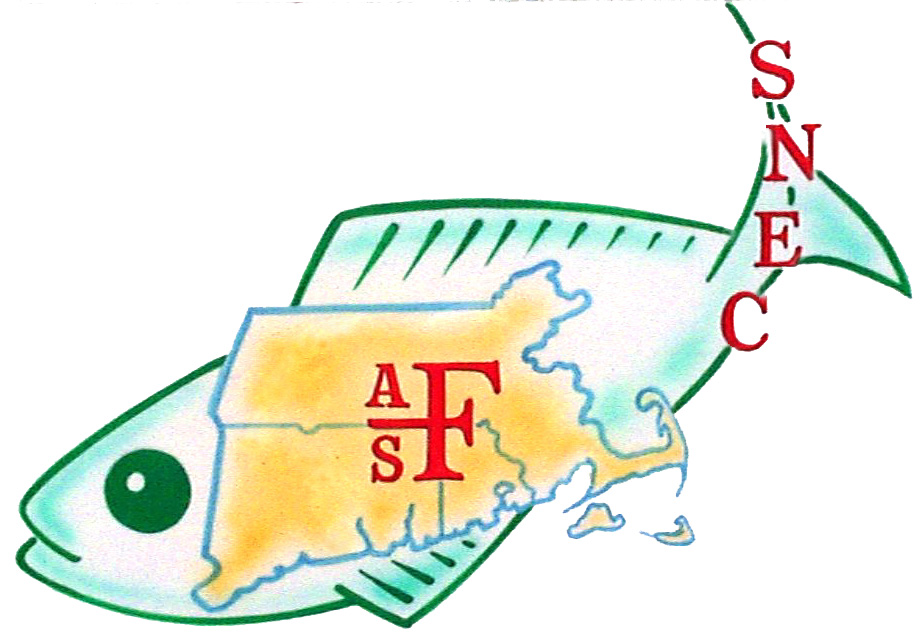

```{r setup, include=FALSE}
knitr::opts_chunk$set(echo = TRUE)
library(blastula)
library(rstudioapi)
devtools::source_gist(
  "c83e078bf8c81b035e32c3fc0cf04ee8", 
  filename = 'render_toc.R'
  )
```

<center> 
<font size="24"> **SNEC Newsletter** </font>

<font size="5"> *`r Sys.Date()` * </font>

{width=300px}
</center>


```{r toc, echo=FALSE} 
render_toc(getSourceEditorContext()$path)
```

## Announcements 

### Fishery Decarbonization Survey Seeks Participants

Vanessa Sedore (Brown University thesis senior) and Sarah Schumann (Fishery Friendly Climate Action) are looking for fishery ecosystem scientists to participate in an expert elicitation exercise focused on scoring the known and potential impacts of a range of decarbonization (aka climate change mitigation) strategies on fishery-supporting ecosystems. We welcome both young and established professionals, but participants must at a minimum be working towards an advanced degree in fisheries science, ecology, oceanography, or a related field. Please consider participating yourself, or spreading the word to others in your network who may be interested.

- To learn more [click here...](https://docs.google.com/document/d/16axA_Vjz8B9xmabGmT5pvLhJpLrV5w0I4V4zW_od2wE/edit)
- To sign up [click here...](https://docs.google.com/forms/d/e/1FAIpQLSfh-l56OeAfgGuKEpgB7LdxWsE_h9ItDTcjFOGS4hmv5XXiIw/viewform)
- Attend the training webinar on January 12 at 1200 [click here](https://us06web.zoom.us/j/6602187069?pwd=cU1MbVlYejJkREtUWUM4RmxrbGFkQT09)


## Member Submitted Content

### Seminar on Scientific Communication Available

Looking for training on scientific communication? This [seminar is available as a recording](https://noaabroadcast.adobeconnect.com/pzo2iagbswdw/): McBride, R. S. 2023. The architecture of a scientific article: perspectives for readers and authors. NOAA Science Seminar Series. January 27.  

### Sea Grant and NOAA Fisheries Announce 2023 Joint Fellowship Program Awardees 

Sea Grant and NOAA Fisheries are pleased to announce the [2023 National Marine Fisheries Service (NMFS)-Sea Grant Joint Fellowship recipients](https://seagrant.noaa.gov/NMFS-SG-Fellowship). Seven population and ecosystem dynamics fellowships and one marine resource economics fellowship will be awarded through this national program.

To read the full story [click here...](https://seagrant.noaa.gov/sea-grant-and-noaa-fisheries-announce-2023-joint-fellowship-program-awardees/)

## Recently Published Research 

### The Structures of the Demersal Fish Communities of New Bedford and Gloucester Harbors, Two Massachusetts Urban Estuaries

> Geoghegan Paul, Michael D. Murphy, and Anthony R. Wilbur. 2023, Northeastern Naturalist.

We sampled the inshore fish communities of New Bedford and Gloucester harbors synoptically using identical gear for 12 months during 1998–1999. Although the 2 harbors are only 110 km apart, they are separated by Cape Cod, which is the transition between the southern New England (New Bedford) and the Gulf of Maine (Gloucester) biogeographic regions. The 2 fish communities were 69% dissimilar from each other using the Bray–Curtis dissimilarity index (B–C). *Stenotomus chrysops* (Scup) composed 80% of the catch in New Bedford Harbor, did not occur in Gloucester Harbor, and contributed 7.40% to the total dissimilarity between the harbors. B–C identified 2 seasonal groups in the New Bedford Harbor fish community: May–October and November–April. *Leucoraja spp.* (skates) comprised the most numerous taxon captured in Gloucester Harbor, accounting for 24.90% of the total catch followed by *Pseudopleuronectes americanus* (Winter Flounder; 24.16%), and *Gadus morhua* (Atlantic Cod; 22.52%). These taxa contributed 7.23%, 3.88%, and 6.16% respectively to the total dissimilarity between harbors. B–C identified 4 seasonal groups in Gloucester Harbor: January, February and March, April and May, and June–December. These data provide an important description of the fish communities in the 2 harbors in different biogeographic regions at the end of the 20th century. We expect differences between the communities to decrease with increasing water temperature due to climate change.

[Read the full paper..](https://www.eaglehill.us/NENAonline/articles/NENA-30-2/14-Geoghegan.shtml)

-----

*SNEC exists to encourage exchange of information by members of the American Fisheries Society residing or working within Massachusetts, Connecticut, and Rhode Island. Find us online:*

- [Website](https://snec.fisheries.org/)
- [Facebook](https://facebook.com/SNECAFS)
- [Twitter | X](https://twitter.com/snec_afs)
- [YouTube](https://www.youtube.com/channel/UCsWL2YkP5tkWs2DAXPihvPA/about)

*Submit your own newsletter content [here](https://gcc02.safelinks.protection.outlook.com/?url=https%3A%2F%2Fforms.gle%2F9dny25282o2hRWAW9&data=04%7C01%7Caarcher%40barnstablecounty.org%7C5553f580af294f062e2a08d9b8d1f7aa%7C84475217b42348dbb766ed4bbbea74f1%7C0%7C1%7C637744034233371914%7CUnknown%7CTWFpbGZsb3d8eyJWIjoiMC4wLjAwMDAiLCJQIjoiV2luMzIiLCJBTiI6Ik1haWwiLCJXVCI6Mn0%3D%7C3000&sdata=Lx14NCnMvq3gIEmmuTTgBEy%2Bh3MMFsFE%2FE1216YSy8s%3D&reserved=0)*
